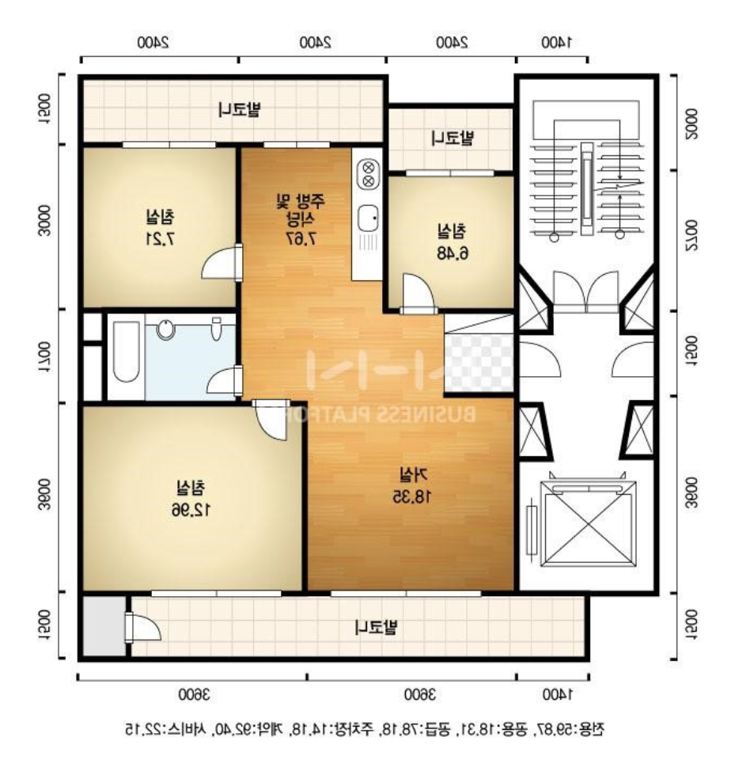
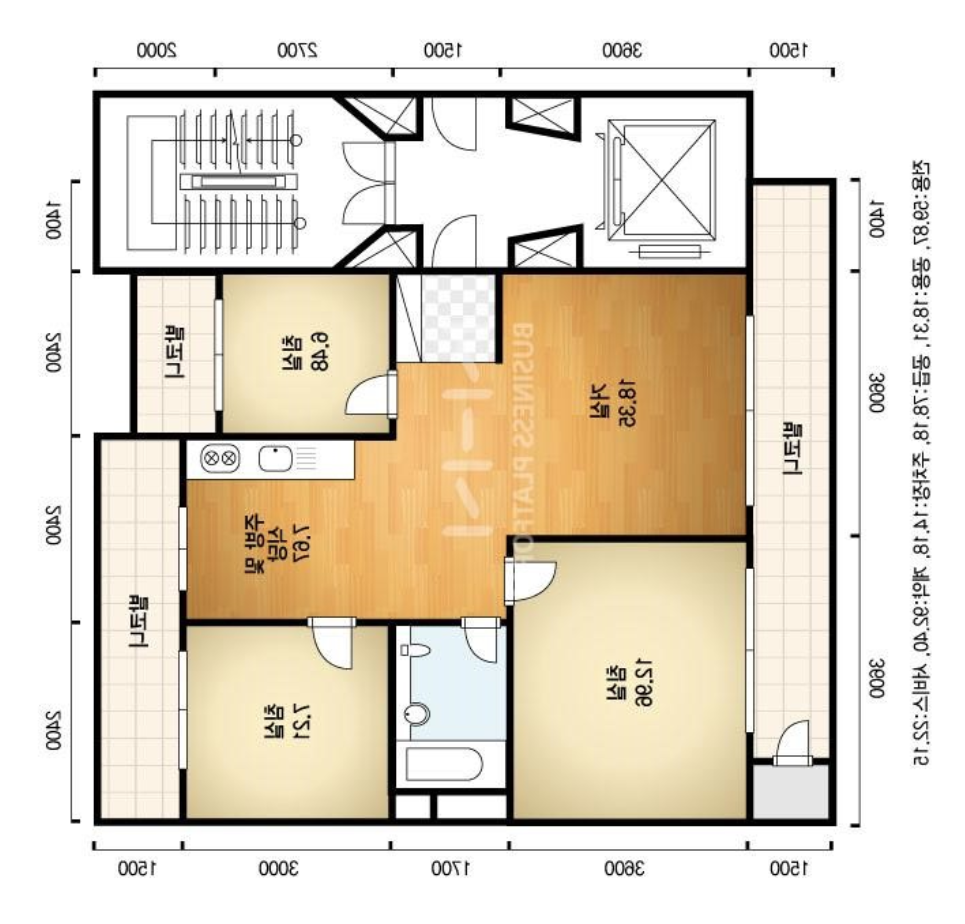
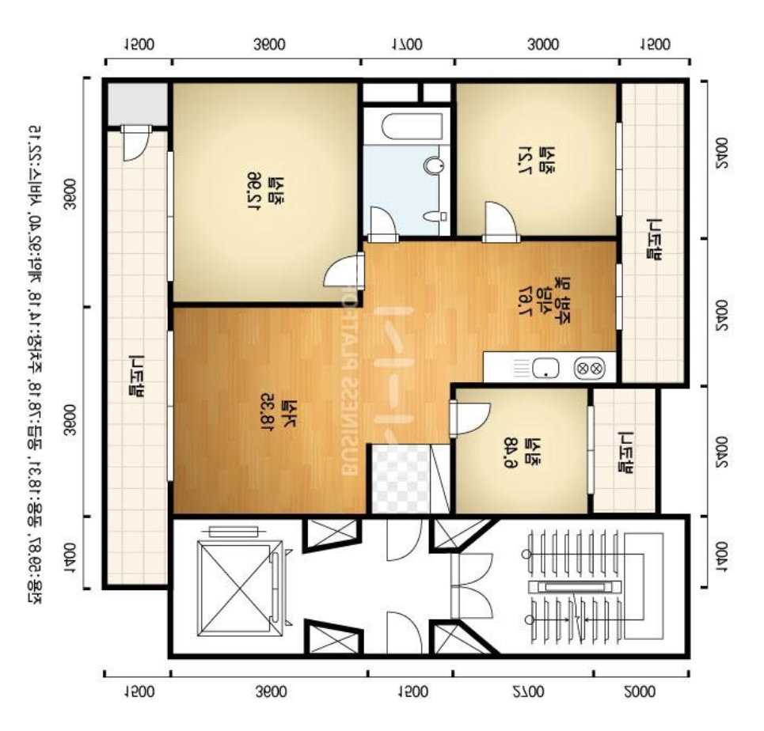

cli 로 이미지 수정을 할 수 있는 [ImageMagick](https://www.imagemagick.org/)의 사용 사례

# 반전 시키기

## 필요

이사갈 집의 평면도 이미지를 구했는데, 내가 들어갈 동은 평면도 이미지와 방향이 일치하지 않았다. 이미지를 어떻게 뒤집어놓으면 내 머릿속에서 변환할 필요 없이 집 구조와 동일하게 매핑하는게 편할 것 같았다.

'거울반전' 같은 용어가 떠올랐지만, 내가 원하는 반전의 정의가 거울반전과 일치하는지는 잘 모르겠다. 아무튼 거울반전은 flip horiziontally 인듯한데, 용어를 찾다보니 내가 원하는 방향을 정확하게 뭐라고 부르는지 더욱 모르게되었다. 아무튼.

## 진행

사용할만한 옵션을 찾아보니 4가지 종류가 있어서 다 출력해보기로 함.

```
-flip               # vertical
-flop               # horizontal
-transpose          # flip vertical + rotate 90deg
-transverse         # flip horizontal + rotate 270deg
```


```
$ convert original.png -flip flip.png
$ convert original.png -flop flop.png
$ convert original.png -transpose transpose.png
$ convert original.png -transverse transverse.png
```


### 1. original


### 2. flip


### 3. flop


### 4. transpose


### 5. transverse


## 결과

transverse가 내가 원하는 옵션이었다. 사실 옵션 목록 보고, 대충 찍어서 transverse로 맨먼저 이미지를 뽑아보았는데, 나머지 옵션들로 돌리면 어떻게 될지 궁금해서 다 찍어보게 되었다.


ref.

- https://devhints.io/imagemagick
- https://imagemagick.org/script/convert.php
- http://www.georeference.org/doc/transform_flip_horizontally_flip_vertically.htm
- http://gluebyte.tumblr.com/post/61312905319
- https://terms.naver.com/entry.nhn?docId=3568793&cid=58941&categoryId=58960
