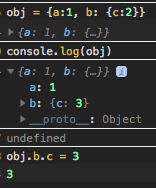
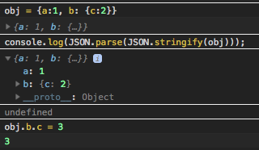

# console 객체의 여러가지 사용법

source : https://medium.com/@mattburgess/beyond-console-log-2400fdf4a9d8

모르던 것들도 몇개 보여서 필요한 부분만 메모.

- `%c` 는 css의 c라고 기억하면 편할듯.
- `%o` 라고 하면 객체를 바로 찍을 수 있음.
- `console.table()`에 두번째 파라메터로 컬럼 이름 배열 넘기면 첫번째 객체에서 pluck 한 내용만 표로 보여줌. 렌더링된 표에서 컬럼 누르면 정렬도 됨.
- `console.trace()` - `console.log` 만으로는 찾기힘들때 스택트레이스 보여줌.

----

다른거 없나하고 [MDN](https://developer.mozilla.org/en-US/docs/Web/API/console) 조금 더 찾아봄.

# 객체 로그 정확하게 남기기

https://developer.mozilla.org/en-US/docs/Web/API/Console/log

>Don't use console.log(obj);,
use console.log(JSON.parse(JSON.stringify(obj)));.

그동안 미심쩍게 느끼던 부분이었는데, 이 주의사항을 이제야 확인함.

단순객체라면 바로 출력되서 크게 영향 없지만, 깊게 내포된 객체(deeply-nested object)를 그냥 `console.log()` 으로 객체 바로 찍으면, 깊게 들어가야 볼 수 있는 객체 정보는 콘솔에서 화살표 누르는 시점에 조회가 되서 값이 바뀌어 있을 수 있다. 라이프 사이클에 따라 조회가 안되는 경우도 있을 것 같다(그동안 내가 미심쩍게 생각하던 부분). 이 작동에 대한 공식적으로 문서화 된 부분은 아직 찾지는 못했는데, 눈으로 바로 볼 수 있을만한 부분까지는 표시하고(검색결과로는 설명에 따라 2depth라고도 하고, 그때그때 다르다고도 하고) 그 이상 뎁스는 생략해서 보여준다고. 아마 퍼포먼스 이슈 때문으로 보임.

예)

`a.b.c`에 2가 들어있는 `a` 객체를 그냥 로깅하면 `a.b`의 값은 생략되어 표시되는데, `a.b` 의 값을 3으로 바꿔 버린 다음에 위에서 로깅해놓았던 a객체의 생략했던 부분을 펼치면, 원래 로그를 찍었던 시점이 아니라 현재 시점의 `a.b`의 값이 보이고 대체로 이것은 원하는 작동이 아닐 것이다.

`a.b.c`에 2가 들어있는 `a` 객체를 stringify해서 로그를 남기면, 이때도 `a.b`의 값은 생략되어 보이지만, 로깅을 하고 나서 `a.b`의 값을 바꾸고 아까 생략된 부분을 펼쳐도 아까 로그 남긴 시점의 값이 제대로 보인다.

----
위와 같은 케이스를 경험했던건 아니고, 그동안 미심쩍게 느꼈던 부분은 복잡한 페이지에서 객체 로그를 잔뜩 찍어놓고 나중에 몰아서 객체 세부 정보 보려고 하면 값이 안 보일때가 있어서 `console.log`가 "리터럴리하게" 있는 그대로 출력을 해놓는게 아니라 객체의 라이프사이클과 뭔가 관련이 있는 것 같다고 의심만 했었는데, 이 부분을 읽고 좀더 확실히 알게됨.
