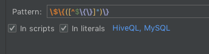

[TOC]

# 유저 파라메터 설정하기

필요:

다른 프로젝트에서 사용하던 쿼리문에 유저 파라메터가 있고 datagrip에서 지원하지 않는 패턴이더라도, 다른 프로젝트와 datagrip 상호간에 쿼리문을 그대로 복붙해서 사용하고 싶다.

예를 들어, `Hue`에서 HiveQL 쿼리문에 파라메터를 넣을때는 `{dt}` 와 같은 패턴으로 들어가는데, datagrip에서 기본으로 지원하는 패턴이 아니라 `Hue`에서 작성한 쿼리를  datagrip에 복붙해놓고 실행할때(혹은 그 반대의 경우에도 마찬가지) `{dt}` 을 실제값으로 치환하거나 다른 문법으로 바꾸거나 하는 과정을 하지 않고 있는 그대로 쓰고 싶다.

해결:

`Settings - Database - User Paramaters`를 찾아간 후 원하는 파라메터 패턴을 등록한다.

Pattern

```
\$\{([^$\{\}]*)\}
```

`In scripts`와 `In literals`를 모두 체크하고, 적용되길 원하는 언어 스콥을 설정한다.



