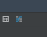
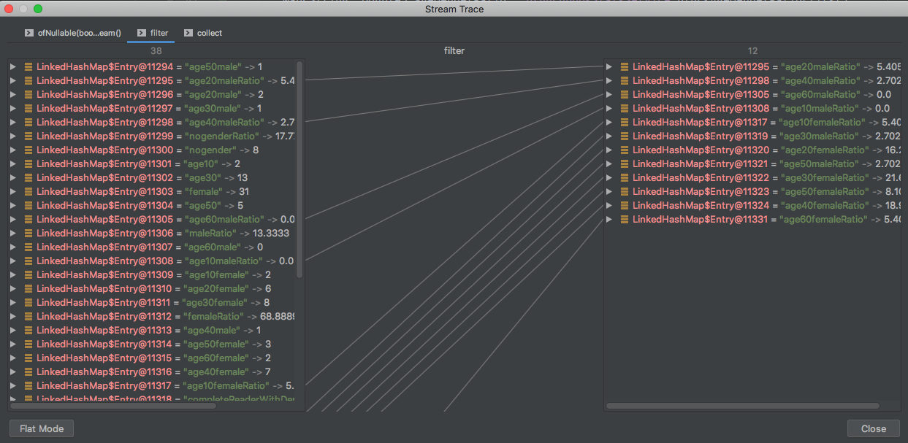

[TOC]

# Java 8 스트림 디버깅하기

컬렉션 스트림을 처리하는데 오퍼레이션이 이어지는 각 단계에서 값이 어떻게 걸러지고 변환되는지 디버깅할 필요가 생겨서, 기능이 있다는 것만 알고 있던 인텔리제이의 자바 스트림 디버깅 기능을 찾아보았다.

디버깅할 위치에 브레이크 포인트를 잡아둔 후, 디버깅 모드에서 브레이크 포인트에 걸려 멈춘 상태에서 디버그 툴바를 보면 trace 버튼이 있다.

이 버튼을 클릭하면 다음과 같이 스트림이 어떤 오퍼레이션을 거칠때 어떻게 변하는지 확인할 수 있다.

참고:
- https://www.jetbrains.com/help/idea/analyze-java-stream-operations.html
