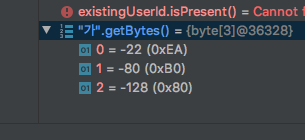

[TOC]

# 디버거 윈도우에서 byte array 의 요소값을 16진수로 보기

발단: 인코딩 관련이슈로 인해 문자열의 byte 값을 뒤져볼일이 있어 디버거 윈도우에서 `byte[]` 값을 보려고 했는데, 아래와 같이 하등 쓸모없는 값이 출력 되었다.

해결 :

settings 에서 `Show hex value for primitives`를 찾아서 사용함으로 체크를 하면 된다.

-- source : https://stackoverflow.com/a/38549812

결과 :

위와 같이 설정하면 byte 값을 아래와 같이 볼 수 있다.

