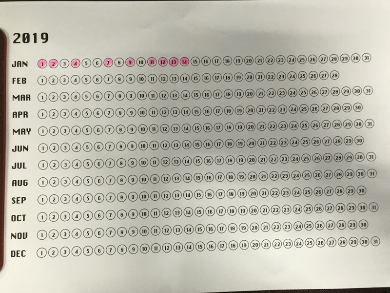

[TOC]

# Year in Pixel

연말연시에 트위터에서 불렛 저널/무드 저널/각종 다이어리 아이디어 및 시각화 기법을 구경할 수 있었는데, 그중 특히 눈에 들어온 것이 year in pixel 차트라는 것인데, 1년 365일을 365개의 픽셀로 만든 다음 색칠하면서 어떤 태스크의 1년동안 진행 상황을 트래킹하고 시각화 할 수 있는 점이 매력적으로 보였다.

[다양한 템플릿](https://www.google.com/search?q=year+in+pixels)이 있지만 우선 트위터 [@grchysmf](https://twitter.com/grchysmf/) 님이 2019년 용으로 공개한 템플릿으로 스타트를 해보려고 한다.

링크:

 - https://twitter.com/grchysmf/status/1079296453808287744
 - https://www.evernote.com/shard/s30/client/snv?noteGuid=6c12eb6b-1bff-47fd-abed-373335acd46a&noteKey=31ec30844f25c4b6&sn=https%3A%2F%2Fwww.evernote.com%2Fshard%2Fs30%2Fsh%2F6c12eb6b-1bff-47fd-abed-373335acd46a%2F31ec30844f25c4b6&title=2019%2B%25EC%2583%2589%25EC%25B9%25A0%2B%25EB%258B%25AC%25EB%25A0%25A5

우선 everyday TIL 을 이렇게 체크하고 있다.

ps.
year in pixel 차트는 [waitbutwhy](https://waitbutwhy.com)의 [Life in weeks](https://waitbutwhy.com/2014/05/life-weeks.html) 캘린더나 [Simone Giertz](https://www.youtube.com/simonegiertz)의 [The Every Day Calendar](https://www.kickstarter.com/projects/simonegiertz/the-every-day-calendar)와 시각화 발상의 근본은 동일한 것 같다.
