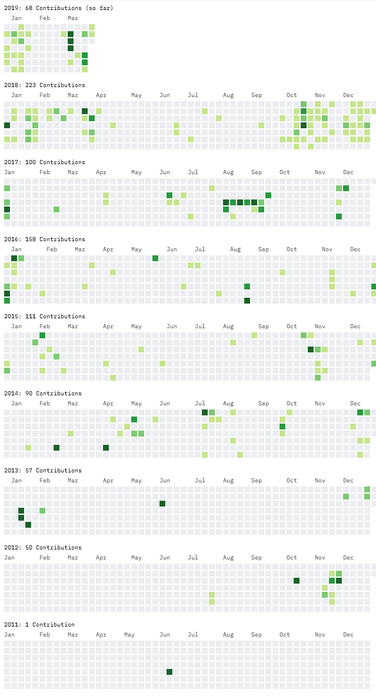
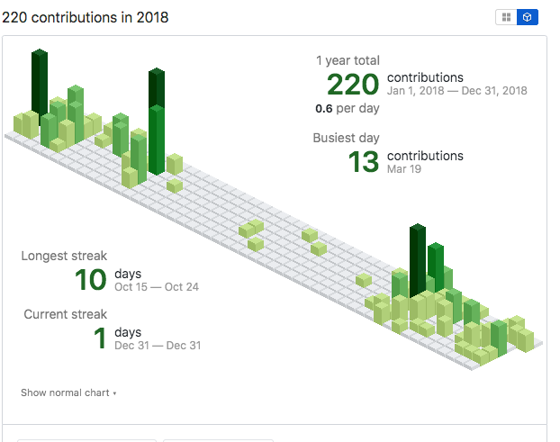

# TIL 작성러 혹은 일일커밋러를 위한 흥미로운 링크 몇가지.

시즌2에서도 공유했던 til, 잔디 관련해서 재미로 둘러볼만한 링크 몇가지.

## geeks diary

https://github.com/seokju-na/geeks-diary

TIL 작성 전용 에디터. 
제 워크플로우를 고쳐쓰긴 귀찮아서 테스트만 해보고 실제로 쓰고 있진 않습니다만 흥미로운 에디터였습니다.

## GitHub Contributions Chart Generator

https://github-contributions.now.sh/

깃헙 잔디 그래프가 1년치씩 밖에 안 보이는데, 이걸 n년치를 한 페이지에서 볼 수 있게 해줍니다.

## Isometric Contributions

https://chrome.google.com/webstore/detail/isometric-contributions/mjoedlfflcchnleknnceiplgaeoegien

크롬 확장인데, 깃헙 잔디 그래프를 isometric pixel view 로 볼 수 있게 해줍니다. 저 용어의 번역어를 뭐라해야할진 모르겠지만... 뭔가 3D 바 차트 같은 느낌입니다.

## github.dev

https://github.dev/

https://github.com/github/personal-website/

본인의 깃헙 저장소와 기여내역, 관심사항 등의 프로파일을 엮어서 보여줄 수 있는 정적 사이트 템플릿입니다. 정확히는, jekyll + jekyll 플러그인과 깃헙에서 제공하는 디자인 테마의 모음입니다. 깃헙에서 제공하는 템플릿이라 별다른 고민 없이 설정값을 조금 고치는 정도로 만들어 볼 수 있다는게 장점입니다.

제가 만들어본 페이지는 다음과 같습니다. [https://github.heesang.dev/](https://github.heesang.dev/)
