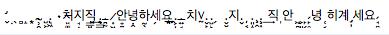

# 개요

단톡방에서 메시지를 보게 되었고, 무슨 유니코드 문자로 만들었을까 하는 얘기에 나도 궁금해져서 유니코드 포인트를 확인해보고 싶었다.



# 경과

파이썬과 유니코드에 대해 아래와 같은 것을 찾아보았다.

## Explicit Unicode literals

`u'text'` 와 같이 유니코드 문자열을 명시하는 것인데.. 파이썬2에 있다가 파이썬3 생기면서 사라졌다가 파이썬 3.3에서 다시 생긴 문법이라는 것 같다. 이게 왜 필요한가, 이게 사라졌다가 다시 생긴 이유는 무엇인가...는 오늘 파보기엔 시간이 없어서 생략.

> Changed in version 3.3: For backwards compatibility with the Python 2 series, the u prefix is once again permitted on string literals. It has no effect on the meaning of string literals and cannot be combined with the r prefix.

source :

- https://www.python.org/dev/peps/pep-0414/
- https://docs.python.org/3.7/library/stdtypes.html#text-sequence-type-str
- https://docs.python.org/3.7/reference/lexical_analysis.html#strings
- https://docs.python.org/3/howto/unicode.html

## ord, chr

`ord()` - 주어진 문자의 유니코드 문자의 유니코드 코드 포인트 값을 정수로 리턴.

`chr()` - 주어진 유니코드 코드 포인트 정수값에 대한 문자를 리턴함.

파이썬2에서는 바이트스트링과 유니코드객체가 구분되어서 ord와 chr, unichr 함수가 있었는데, 파이썬3에서는 ord와 chr로 통일.

----
source :

- https://docs.python.org/3.7/library/functions.html#ord
- https://docs.python.org/3.7/library/functions.html#chr
- https://docs.python.org/2.7/library/functions.html#ord


## 문자열을 한글자씩 나누기

대충  `.split("")` 을 하면 한글자씩 나눠지지 않을까 했는데(ruby, js 등에서 하듯이), 파이썬에서는 empty separator를 허용하지 않았다.

cpython 에서는 찾기 힘들어서, pypy에서 `.split` 의 구현을 찾아 봄.

- https://bitbucket.org/pypy/pypy/src/7eccdb844fb8bfbcb1a647a43118052599df6d28/rpython/rlib/rstring.py?at=default&fileviewer=file-view-default#rstring.py-28
- https://bitbucket.org/pypy/pypy/src/7eccdb844fb8bfbcb1a647a43118052599df6d28/pypy/objspace/std/stringmethods.py?at=default&fileviewer=file-view-default#stringmethods.py-570

검색해보니 권장하는 방법은 `list(str)` 같이 `list()` 생성자를 사용하는 것.

source :
- https://docs.python.org/3.7/library/stdtypes.html#list
- https://docs.python.org/3.7/library/stdtypes.html#text-sequence-type-str

## 유니코드 코드포인트를 `U+XXXX` 포맷으로 출력하기

코드포인트가 integer인데, 유니코드 검색하는 사이트 등에서는 `U+XXXX` 포맷으로 쓰니까 이렇게 출력하는게 편할 것 같은데, 내장된 포맷터는 없는 모양. `str.format()` 으로 넣는 수 밖에 없는듯.

source :

- https://docs.python.org/3.7/library/stdtypes.html#str.format
- https://docs.python.org/3.7/library/string.html#formatstrings
- https://stackoverflow.com/questions/42757013/in-python-3-how-to-print-unicode-codepoint-as-u-u


# 결과

아래와 같이 하면 원 문자열의 각 글자마다의 코드포인트 값이 찍힌다.

에디터에 따라 네모박스로 깨져서 표시되기도 함.

```python
u = u'̛̬̣̖̻̝͙.̴̹̯̝̤ ̺͕̼̫͉̯.̢͖̘̯̮̣ ٠치̵̠͚̹ͅ지̘̣͓͍직̳̠̠͢.̢̳̯̹.̵̪̰̪̗̭̣̞ ̷͎͖̩̪̞̦안̟̱녕̣̭하̰̖̯̻͎͕세̗요̱̱̦̠͙̲.͕̦̰̯̜͇̙͟.̶͍̘치٧̰.̬̙̩͓̠̤̭.̺̙̤̲ ̗  .̬̮지.̬ ̦͔̘̣͈͕͇͟.͈̝͈̲̤̹ ̧̭̼.̧͎̭ ͢직 ̩안 ͖̪̖̲̼ͅ ͕͈̗ ̙̗͙̞ͅ ̙̥̩̘̦̭̣́녕 ̜͔̤͖̟̻̯히계 ̡̦세요 ̘̻̹̞̗̭́'

for i in list(u): print('U+{0:04X} \\U{0:08X} {1}'.format(ord(i),i))
```

http://inamidst.com/stuff/unidata/ 에서 보니 `Combining Diacritical Marks` block 에 해당하는 문자가 많은 듯.

http://graphemica.com/ 에 codepoint 를 넣어보면 각 문자의 정보를 볼 수 있다.

see also http://graphemica.com/blocks/combining-diacritical-marks

TODO: 궁금한 점 - http://graphemica.com/0319 hex가 `0319` 이어야할 것 같은데, `UTF-8` 에서만 `cc99` 로 나온다. 왜 그런지?
