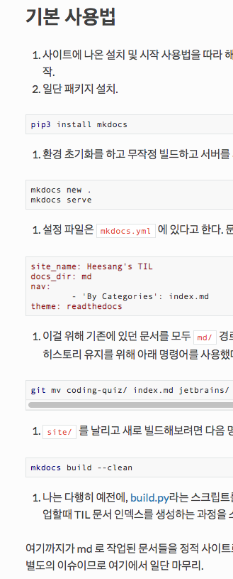
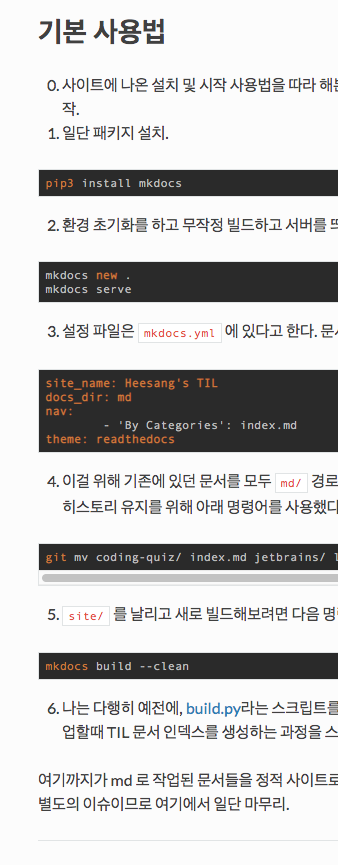

[TOC]

# MkDocs 로 만든 정적 페이지 커스터마이징하기

`mkdocs.yml`에 아래의 내용을 추가하였다.

## 저자 정보


위의 것은 메타 태그로, 아래 것은 사이트 하단에 들어간다.

```
site_author: Heesang Chae
copyright: Heesang Chae
```

## 문서 원본 페이지로 연결

현재 보고 있는 페이지의 원본(`.md`)으로 연결되는 링크가 페이지 우상단에 표시된다.

```
repo_url: https://github.com/theand/til-by-heesang/
edit_uri: blob/master/md/
```


## 코드 하이라이트 테마 변경

`highlightjs` 라이브러리를 이용해 코드 하이라이트를 제공하는데, 지금 사용하는 `readthedocs` 테마에서는 하이라이트 테마 설정을 지원하지 않는다. 그래서 리소스 낭비가 있지만, 디폴트로 로딩하는 `github` 테마 css 이후에 내 취향의 `darcula` 테마 css를 추가로 로딩하여 오버라이드가 되는지 보았더니 원하는대로 되는 것 같다.

아래와 같이 설정하고, `assets/css/` 경로에 `darcula.min.css`를 구해서 넣었다. `assets/` 에 다른 파일들은 나중에 추가로 손볼일이 있을까하여 미리 입력해놓았다.

```
theme:
  name: readthedocs
  highlightjs: true

extra_css:
  - assets/css/til.css
  - assets/css/darcula.min.css
extra_javascript:
  - assets/js/til.js

```

`github` 테마



`darcula` 테마



## 마크다운 확장 추가 적용

`MkDocs`에서 사용하는 파이썬 마크다운 파서 라이브러리에 기본적으로 제공되는 확장의 목록을 보고 그중에 쓸만한 것을 적용하였다. 차례대로, 줄바꿈을 BR 태그로 변환해주는 것, 목록 문법이 좀더 의도대로 나올 수 있게 보완해주는 것, 목차가 표시를 지원하는 것이다.


```
markdown_extensions:
  - nl2br
  - sane_lists
  - toc:
      permalink: false
```
