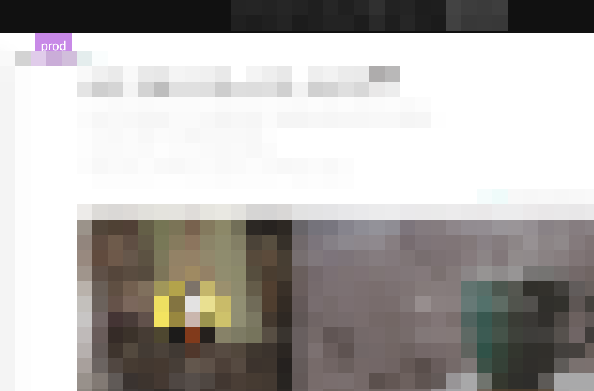
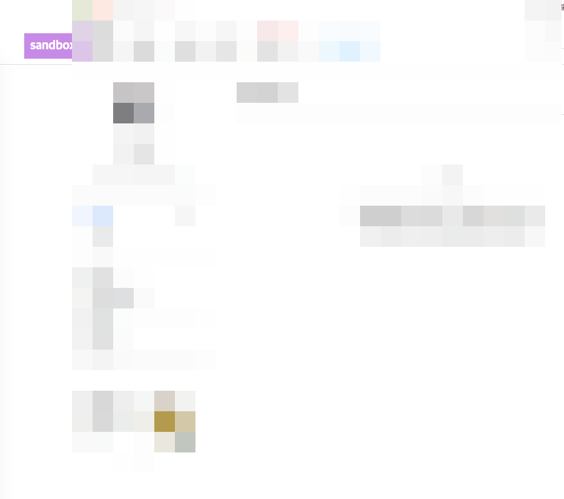

# 서비스 개발자를 위한 페이즈 뱃지 표시 유저스크립트

## 용도

- 페이즈 뱃지(phase badge) : 그냥 내가 만들 말인데, 서비스 개발을 하다보면 dev/stage/real/sandbox/cbt/production/live 등의 용어로 서비스의 배포 단계(deploy phase)를 구분하기 마련이고, 이들은 거의 같은 디자인의 웹페이지이고 도메인도 대충 비슷하지만 다르게 구성되어 있을 것이다. 개발하면서 이슈 처리를 위해 이 페이즈와 저 페이즈를 왔다갔다하다보면 개발서버인줄 알고 보다보니 프로덕션 서버였고 하는 일이 이따금 생길 수 있다. 그래서 지금 보고 있는게 어느 페이즈인지 브라우저 주소창의 주소를 통해 식별해야하는게 너무 귀찮아서 적당한 뱃지(라기엔 그냥 박스지만) 표시를 CSS pseudo element를 통해 주입하여 써오고 있다.






- 예전에는 [Stylebot](https://chrome.google.com/webstore/detail/stylebot/oiaejidbmkiecgbjeifoejpgmdaleoha)이라는 크롬확장을 통해, 도메인마다 지정하여 써오고 있었는데, 크롬확장보다 userscript가 메모리를 덜 먹을 듯 하여, 이번에 새로운 조직에 합류하여 업무를 시작하게 된 김에 userscript로 옮겨보았다.


## 코드


아래 코드는 다음과 같은 주소 패턴을 가진 서비스를 가졌고, phase 구분은 `local/sandbox/cbt/prod` 으로 한다고 가정했을 경우이다.

- http://local.product.awesomeservice.com
- http://dev.product.awesomeservice.com
- https://sandbox.product.awesomeservice.com
- https://cbt.product.awesomeservice.com
- https://product.awesomeservice.com


```javascript
// ==UserScript==
// @name        phase-badge-for-SERVICE-NAME
// @namespace   http://127.0.0.1
// @description User Script for phase-badge-for-SERVICE-NAME
// @author      Heesang Chae
// @include     /https?://.*product.awesomeservice.com
// @require     https://cdn.jsdelivr.net/gh/theand/userscript-util@latest/add.js
// @require     https://cdn.jsdelivr.net/gh/theand/userscript-util@latest/element.js
// @require     https://cdn.jsdelivr.net/gh/theand/userscript-util@latest/exec.js
// @version     2019.01.04
// @grant       none
// ==/UserScript==


/*global userscript_util*/

const userscript = function (GM_info) {

    console.group(GM_info.script.name);

    userscript_util.exec.logGmInfo(GM_info);


    const HostMap = [
        {
            phase: "local",
            hosts: [
                "local.product.awesomeservice.com",
                "local-my.product.awesomeservice.com",
            ]
        },
        {
            phase: "sandbox",
            hosts: [
                "dev.product.awesomeservice.com",
                "m-dev.product.awesomeservice.com",
                "sandbox.product.awesomeservice.com",
                "m-sandbox.product.awesomeservice.com",
            ]
        },
        {
            phase: "cbt",
            hosts: [
                "cbt.product.awesomeservice.com",
                "m-cbt.product.awesomeservice.com",
            ]
        },
        {
            phase: "prod",
            hosts: [
                "product.awesomeservice.com",
                "m.product.awesomeservice.com",
            ]
        }
    ];

    const findPhase = (hostname) => {
        const found = HostMap.filter( e => e.hosts.includes(hostname))[0];
        console.log(found);
        return found.phase;
    };

    try {
        const url = new URL(document.location);
        const hostname = url.hostname;
        console.log(`current hostname is ${hostname}`);
        const key = findPhase(hostname);
        console.log(`phase key is ${key}`);
        const button = userscript_util.element.pseudoBodyButtonWith(key);
        userscript_util.add.addGlobalStyle(button);
    } catch (err) {
        userscript_util.exec.logGmError(GM_info, err);
    }

    console.groupEnd();

};

if (top.document.location === self.document.location) {
    userscript_util.exec.executeLater(userscript, GM_info, 500);
}

```
